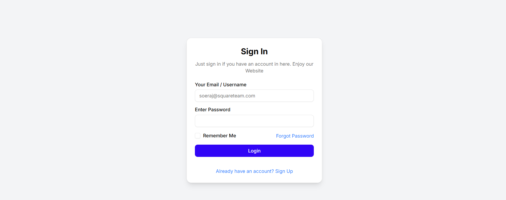
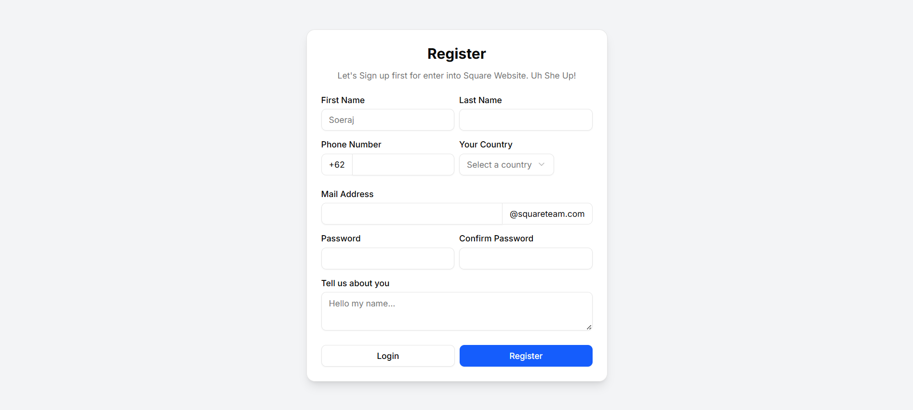
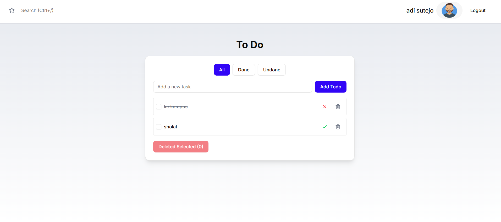
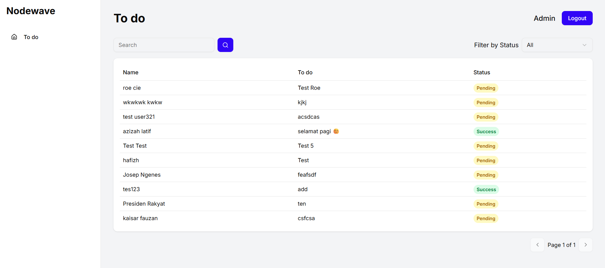

# NodeWave Front End Candidate Assessment: Todo App

Ini adalah implementasi aplikasi **To-Do**.  
Aplikasi ini dibangun menggunakan **Next.js** dan **TypeScript**, dengan fokus pada kualitas kode, performa, dan fungsionalitas yang sesuai dengan persyaratan.

---

##  Daftar Isi
1. [Fitur Utama](#-fitur-utama)
2. [Teknologi yang Digunakan](#-teknologi-yang-digunakan)
3. [Cara Menjalankan Proyek](#-cara-menjalankan-proyek)
4. [Struktur Proyek](#-struktur-proyek)
5. [API Endpoints](#-api-endpoints)

## 🖼 Preview
Halaman Login  


Halaman Register  


Halaman Todo  


Halaman Admin  


---

##  Fitur Utama

### Fitur Wajib (Mandatory)
- **Autentikasi Pengguna**
  - **Daftar (Register):** Pengguna dapat membuat akun baru.
  - **Masuk (Login):** Pengguna dapat masuk dengan kredensial yang valid.

- **Pengelolaan To-Do**
  - **Membuat To-Do Baru:** Menambahkan tugas baru ke daftar.
  - **Mendapatkan Semua To-Do:** Menampilkan daftar semua to-do yang dimiliki pengguna.
  - **Menandai Selesai / Belum Selesai:** Mengubah status to-do dengan mengklik checkbox atau ikon status.
  - **Menghapus To-Do:** Menghapus to-do per item atau secara massal melalui fitur **"Delete Selected"**.
  - **Filter To-Do:** Memfilter daftar berdasarkan status (**All, Done, Undone**).

---

### Fitur Opsional (Optional)
- **Halaman Admin**
  - Halaman khusus untuk admin yang dilindungi.
  - Melihat semua to-do dari semua pengguna.
  - Fitur filtering dan pagination.

---

##  Teknologi yang Digunakan
- **Bahasa & Framework:** TypeScript, Next.js (App Router)
- **Styling:** Tailwind CSS, Shadcn UI
- **Manajemen State:** Zustand
- **Data Fetching:** React Query, Axios
- **Validasi:** Zod (sudah terintegrasi, tetapi belum diimplementasikan di semua field)
- **Notifikasi:** Sonner
- **Ikon:** Lucide React

---

##  Cara Menjalankan Proyek

1. **Kloning Repositori**
   ```bash
   git clone https://github.com/RizqiJagad/Technical-Assessment-Front-end.git
   cd Technical-Assessment-Front-end

2. **Instal Dependensi**
    ```bash
    npm install

3. **Jalankan Website di Mode Pengembangan**
    ```bash
    npm run dev

43. **Jalankan Website di Mode Pengembangan**
    ```bash
    http://localhost:3000

**Live Demo:** 
[technical-assessment-front-end.vercel.app](https://technical-assessment-front-end.vercel.app/)
